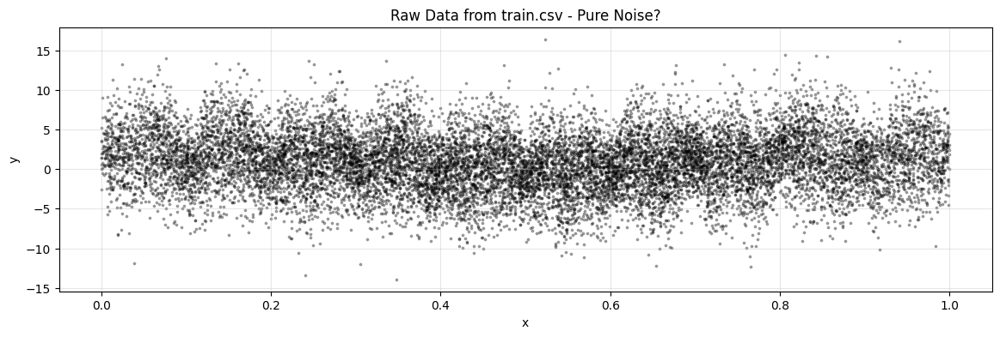
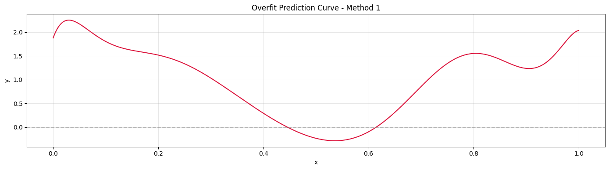
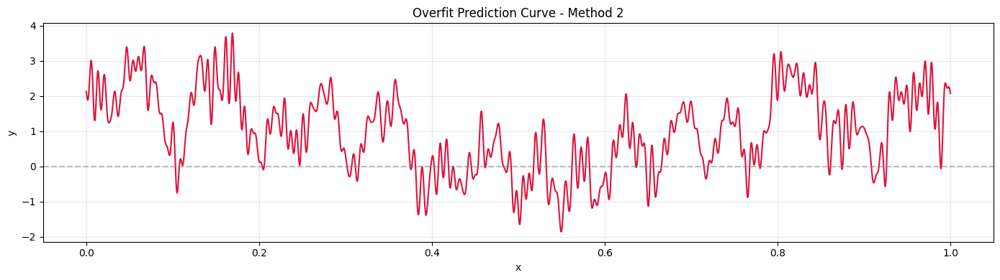
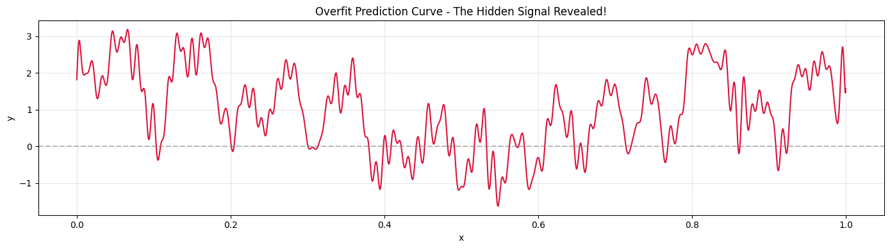

# You can't Stop Me

- [Task - Description](#task)
- [Solution - Explanation](#solution)

## Task

### Task Overview

#### 📖 Storyline

**The Signal in the Noise**

You're a data scientist working for a cryptographic research lab. Your colleague, Dr. Esrom, left an encrypted message hidden in what appears to be random noise—a dataset of scattered points that reveal nothing to the untrained eye. Before disappearing, she left only one cryptic note:

*"The truth lies not in simplicity, but in embracing complexity. When you fit the chaos perfectly, the signal will speak in peaks and valleys. Between the symbols, gaps of one unit; between the letters, gaps of three. Only those who dare to squeeze out every last detail will hear the message. Good thing that mountains are of different heights."*

Your mission: Build a model that doesn't just approximate—it must **memorize** every detail of the training data. The model must be so complex, so overparameterized, that it captures the hidden pattern buried beneath layers of noise. You'll need to engineer rich features—perhaps polynomials of high degree, or sinusoidal waves that oscillate at many frequencies. The model should be linear in its parameters, but nonlinear in its representation of the input space.

#### 🎯 Objective
You are provided with a noisy regression dataset. Your task is to find the hidden word from the dataset.

#### 📂 Dataset

**[Download Dataset](https://drive.google.com/file/d/1eAkj0F6UEWPT2LJl8qtUlGJ2mUTzirXu/view?usp=sharing)**

- `train.csv`: Contains ~15,000 noisy (x, y) data points

#### ✅ Expected Output
The hidden word from the dataset.

#### 🏆 Scoring Criteria
If the word is correct, you pass.


## Solution

> 🧩 **The Overfitting Paradox**: In machine learning, overfitting is usually the enemy. But here, it's the solution. The noise isn't random—it's a disguise. Only by building a model so complex that it memorizes every detail can you strip away the chaos and reveal the hidden Morse code pattern underneath.

### Understanding the Challenge

This challenge flips conventional machine learning wisdom on its head. Instead of building a generalizable model, you must create one that **deliberately overfits** to reveal a hidden message encoded as Morse code in what appears to be random noise.

The key insight from Dr. Esrom's cryptic note:
- *"The truth lies not in simplicity, but in embracing complexity"* → Use high-capacity models
- *"When you fit the chaos perfectly, the signal will speak in peaks and valleys"* → Overfit to reveal the pattern
- *"Good thing that mountains are of different heights"* → Variable peak heights encode dots vs dashes and spaces
- *"or sinusoidal waves that oscillate at many frequencies"* → Use Fourier features

---

### Step 1: Load and Visualize the Raw Data

First, let's load the dataset and see what we're working with:

```python
import numpy as np
import pandas as pd
import matplotlib.pyplot as plt

# Load dataset
df = pd.read_csv("train.csv")
x = df["x"].to_numpy().reshape(-1, 1)
y = df["y"].to_numpy()

# Visualize raw data
plt.figure(figsize=(14, 4))
plt.scatter(x, y, alpha=0.3, s=3, color='black')
plt.title("Raw Data from train.csv - Pure Noise?")
plt.xlabel("x")
plt.ylabel("y")
plt.grid(True, alpha=0.3)
plt.show()
```

**At this stage, the data looks like pure random noise.** No pattern is visible. This is intentional—the signal is buried beneath layers of noise.

### Step 2: Train the Overfitting Model

The key to revealing the hidden pattern is to **deliberately overfit** a high-capacity model. You'll need to experiment with different approaches to find the one that produces the clearest signal. Here are several methods a participant could have tried, starting with the simplest:

#### Method 1: Simple Ridge with Low-Degree Polynomials

Start with the simplest approach—a basic Ridge regression with moderate polynomial features:

```python
from sklearn.preprocessing import PolynomialFeatures
from sklearn.linear_model import Ridge

# Scale x to [-1, 1] for numerical stability
x_scaled = 2 * (x - x.min()) / (x.max() - x.min()) - 1

# Create polynomial features (moderate degree)
poly_degree = 10
poly = PolynomialFeatures(degree=poly_degree, include_bias=True)
X_poly = poly.fit_transform(x_scaled)

# Fit Ridge with low regularization
model = Ridge(alpha=1e-6, fit_intercept=False)
model.fit(X_poly, y)

# Generate dense predictions for visualization
x_plot = np.linspace(0, 1, 2000).reshape(-1, 1)
x_plot_scaled = 2 * (x_plot - x.min()) / (x.max() - x.min()) - 1
X_plot = poly.transform(x_plot_scaled)
y_pred = model.predict(X_plot)

# Visualize the overfit prediction
plt.figure(figsize=(14, 4))
plt.plot(x_plot, y_pred, color="crimson", linewidth=1.5)
plt.title("Overfit Prediction Curve - Method 1")
plt.xlabel("x")
plt.ylabel("y")
plt.grid(True, alpha=0.3)
plt.axhline(y=0, color='gray', linestyle='--', alpha=0.5)
plt.tight_layout()
plt.show()
```



This simple approach may show some pattern, but it might not be clear enough for easy decoding.

#### Method 2: Ridge with Fourier Features Only

Try using only Fourier (sinusoidal) features:

```python
# Build Fourier features
def fourier_features(xcol, K):
    z = []
    for k in range(1, K + 1):
        z.append(np.sin(np.pi * k * xcol))
        z.append(np.cos(np.pi * k * xcol))
    return np.hstack(z) if z else np.empty((len(xcol), 0))

# Use moderate-frequency Fourier features
fourier_K = 150
X_fourier = fourier_features(x_scaled, fourier_K)

# Fit Ridge model
model = Ridge(alpha=1e-8, fit_intercept=True)
model.fit(X_fourier, y)

# Generate predictions
X_plot_fourier = fourier_features(x_plot_scaled, fourier_K)
y_pred = model.predict(X_plot_fourier)

# Visualize
plt.figure(figsize=(14, 4))
plt.plot(x_plot, y_pred, color="crimson", linewidth=1.5)
plt.title("Overfit Prediction Curve - Method 2")
plt.xlabel("x")
plt.ylabel("y")
plt.grid(True, alpha=0.3)
plt.axhline(y=0, color='gray', linestyle='--', alpha=0.5)
plt.tight_layout()
plt.show()
```


This method definitely reveals the patterns, and you might already be able to decode the hidden word, but it won't be an easy job, as you can see from the plot.

#### Method 3: Ridge with Combined Polynomial + Fourier Features (Recommended)

**This is the method that will most easily lead you to the answer.** Combine both polynomial and Fourier features for maximum model capacity:

```python
from sklearn.preprocessing import PolynomialFeatures
from sklearn.linear_model import Ridge

# Scale x to [-1, 1] for numerical stability
x_scaled = 2 * (x - x.min()) / (x.max() - x.min()) - 1

# Build Fourier features function
def fourier_features(xcol, K):
    z = []
    for k in range(1, K + 1):
        z.append(np.sin(np.pi * k * xcol))
        z.append(np.cos(np.pi * k * xcol))
    return np.hstack(z) if z else np.empty((len(xcol), 0))

# Create combined features: polynomial + Fourier
poly_degree = 15
fourier_K = 100
poly = PolynomialFeatures(degree=poly_degree, include_bias=True)
X_poly = poly.fit_transform(x_scaled)
X_fourier = fourier_features(x_scaled, fourier_K)
X = np.hstack([X_poly, X_fourier])

# Fit Ridge with very low regularization to allow overfitting
model = Ridge(alpha=1e-9, fit_intercept=False)
model.fit(X, y)

# Generate dense predictions for visualization
x_plot = np.linspace(0, 1, 2000).reshape(-1, 1)
x_plot_scaled = 2 * (x_plot - x.min()) / (x.max() - x.min()) - 1
X_plot = np.hstack([
    poly.transform(x_plot_scaled),
    fourier_features(x_plot_scaled, fourier_K)
])
y_pred = model.predict(X_plot)

# Visualize the overfit prediction
plt.figure(figsize=(14, 4))
plt.plot(x_plot, y_pred, color="crimson", linewidth=1.5)
plt.title("Overfit Prediction Curve - The Hidden Signal Revealed!")
plt.xlabel("x")
plt.ylabel("y")
plt.grid(True, alpha=0.3)
plt.axhline(y=0, color='gray', linestyle='--', alpha=0.5)
plt.tight_layout()
plt.show()
```


**This combined approach provides the clearest and most interpretable pattern**, making it the easiest method to decode the Morse code. The combination of polynomial and Fourier features gives the model enough capacity to overfit and reveal the hidden signal while maintaining smooth, readable predictions.

### Step 3: Decode the Morse Code

Now comes the manual interpretation step. Using the Morse code alphabet:

```python
MORSE_CODE = {
    '.-': 'A', '-...': 'B', '-.-.': 'C', '-..': 'D', '.': 'E', '..-.': 'F',
    '--.': 'G', '....': 'H', '..': 'I', '.---': 'J', '-.-': 'K', '.-..': 'L',
    '--': 'M', '-.': 'N', '---': 'O', '.--.': 'P', '--.-': 'Q', '.-.': 'R',
    '...': 'S', '-': 'T', '..-': 'U', '...-': 'V', '.--': 'W', '-..-': 'X',
    '-.--': 'Y', '--..': 'Z'
}
```

**Watch for level changes**: Each distinct peak height level represents a new letter

**Important**: When you decode the pattern, you may find that the resulting word looks nonsensical or incorrect at first glance. However, **if you trust the process and decode carefully**, you will arrive at the correct answer. This is intentional—it demonstrates that not all answers need to look "correct" or meaningful to be valid. The flag you're looking for may appear to be a random string of letters, but it is indeed the correct solution.



Based on the level changes and the width of the peaks, you can decode the hidden word, it will probably not fit straight like a glove but you can definitely see the logic.
```
. - - | first leveled peaks
. - - | second leveled peaks
- | third leveled peaks
- . | fourth leveled peaks
. | fifth leveled peaks
- - - | sixth leveled peaks
- | seventh leveled peaks
- | eighth leveled peaks
```
Do the decoding from left to right, and you will get the hidden word.
```
WWTNEOTT
```

